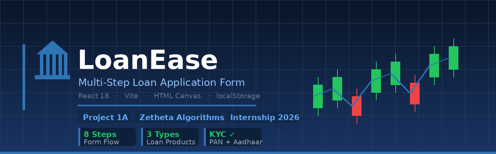

# LoanEase — Multi-Step Loan Application Form

[](https://github.com/adityakr09/Zetheta-Project1a-Loanform)
[](https://github.com/adityakr09/Zetheta-Project1a-Loanform)
[](https://react.dev)
[](https://vitejs.dev)
[](https://github.com/adityakr09/Zetheta-Project1a-Loanform)

> **Zetheta Algorithms | Full Stack Engineer Internship | Project 1A**

A production-grade, 8-step loan application form built with **React 18** — supporting Personal, Home, and Business loan types with real-world fintech features like PAN/Aadhaar verification, e-signature, document upload, and a rule-based eligibility engine.

---

## 📸 Screenshots

| Step 1 — Loan Type | Step 2 — Personal Details |
|---|---|
|  |  |

| Step 3 — Employment | Step 4 — Loan + EMI Calculator |
|---|---|
|  |  |

---

## ✨ Features

| # | Feature | Details |
|---|---|---|
| 1 | 🔀 **8-Step Flow** | Loan Type → Personal → Employment → Loan → Docs → Sign → Review → Result |
| 2 | 🏠 **3 Loan Types** | Personal, Home, Business — each with conditional fields |
| 3 | 🪪 **KYC Simulation** | PAN & Aadhaar verification with fake API delay + address autofill |
| 4 | 📎 **Document Upload** | Image preview, type & size validation, per-loan required doc list |
| 5 | ✍️ **E-Signature** | HTML Canvas — works on both mouse and mobile touch |
| 6 | 💾 **Auto-Save** | localStorage — resume your application after closing the tab |
| 7 | 📊 **EMI Calculator** | Real-time indicative EMI with standard P×r×(1+r)^n formula |
| 8 | 🧮 **Eligibility Engine** | Income × multiplier + CIBIL score → approval/rejection with reason |
| 9 | ✏️ **Edit Navigation** | Review page → Edit any section → jump directly back to that step |
| 10 | 📱 **Responsive** | Mobile and desktop friendly |

---

## 🛠️ Tech Stack

```
React 18          — UI layer (plain useState, no Redux)
Vite              — Build tool & dev server
Plain CSS         — 100% custom styles, no Tailwind, no UI library
localStorage API  — Auto-save & resume
HTML Canvas API   — E-signature pad (mouse + touch)
FileReader API    — Document preview before upload
No form libraries — All validation written from scratch
```

> **Why no fancy libraries?**
> Plain `useState`, custom `validate()` functions, manual regex — readable, debuggable, interview-explainable.

---

## 🚀 Getting Started

```bash
# Clone
git clone https://github.com/adityakr09/Zetheta-Project1a-Loanform.git
cd Zetheta-Project1a-Loanform

# Install
npm install

# Run
npm run dev
```

Open **[http://localhost:5173](http://localhost:5173)**

---

## 📁 Project Structure

```
project1a/
├── index.html
├── package.json
├── vite.config.js
├── assets/                            ← Screenshots & banner
│   ├── banner.png
│   ├── Demo_1.png  →  Demo_4.png
└── src/
    ├── App.jsx                        ← Step routing + auto-save logic
    ├── App.css                        ← All styles (single file)
    ├── main.jsx
    ├── components/
    │   ├── StepIndicator.jsx          ← 8-step progress bar
    │   └── FormComponents.jsx         ← Input / Select / NavButtons
    ├── steps/
    │   ├── Step1_LoanType.jsx         ← Card-based loan type picker
    │   ├── Step2_PersonalDetails.jsx  ← PAN, Aadhaar, address
    │   ├── Step3_Employment.jsx       ← Conditional: salaried vs business
    │   ├── Step4_LoanDetails.jsx      ← Amount, purpose, tenure, EMI preview
    │   ├── Step5_Documents.jsx        ← Upload with image preview
    │   ├── Step6_ESignature.jsx       ← Canvas signature pad
    │   ├── Step7_Review.jsx           ← Full summary + per-section edit
    │   └── Step8_PreApproval.jsx      ← Eligibility result + next steps
    └── utils/
        └── validators.js              ← All validators + eligibility engine
```

---

## 🧮 Eligibility Engine Logic

```js
// Maximum eligible loan
maxEligible = monthlyIncome × multiplier
// Personal → 40x  |  Home → 60x  |  Business → 50x

// Interest rate by CIBIL score
score ≥ 750  →  8.5% p.a.   ✅ Excellent
score ≥ 700  →  10.5% p.a.  ✅ Good
score ≥ 650  →  12.5% p.a.  ⚠️  Fair
score < 650  →  ❌ Rejected

// Standard EMI formula
EMI = P × r × (1+r)^n / ((1+r)^n - 1)
// P = principal | r = monthly rate | n = tenure months
```

---

## 📋 Deliverables Mapping

| Part | Requirement | Implemented In |
|---|---|---|
| Part 1 | 8+ step architecture with state management | `App.jsx` |
| Part 2 | Conditional fields for all 3 loan types | `Step3_Employment`, `Step4_LoanDetails` |
| Part 3 | PAN/Aadhaar verification + address autofill | `Step2_PersonalDetails`, `validators.js` |
| Part 4 | Document upload with preview + size check | `Step5_Documents` |
| Part 5 | Auto-save + resume functionality | `App.jsx` → localStorage |
| Part 6 | Pre-approval summary + eligibility engine | `Step8_PreApproval`, `validators.js` |
| Part 7 | Cross-step review with section edit navigation | `Step7_Review` |
| Final | Production-grade submission + documentation | This repo |

---

## 👨‍💻 Author

**Aditya Kumar** — Backend Engineer · AI-Integrated Systems

[](https://linkedin.com)
[](https://github.com/adityakr09)

---

> *Submitted as part of the **Zetheta Algorithms Full Stack Engineer Internship Program** — Project 1A · Days 1–15 · 2026*
